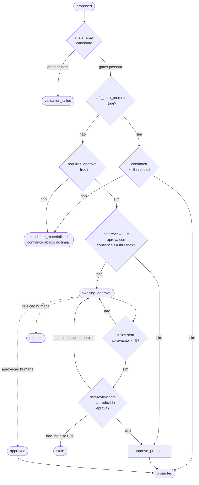

# Entrega Final: Pipeline Medalhão com Camada Agêntica

Este repositório implementa a entrega final do teste descrito em [docs/technical-test-data-ai-engineering.md](/home/lucas/projects/lucas54neves/namastex-test/namastex-test-1/docs/technical-test-data-ai-engineering.md). A solução foi desenhada para atender ao ponto central do enunciado: não apenas gerar análises sobre conversas de WhatsApp, mas construir uma infraestrutura persistente em Python que ingere dados transacionais, publica camadas Bronze -> Silver -> Gold e opera com uma camada agêntica responsável por monitorar, planejar remediações, propor evoluções e manter a Gold atualizada conforme a fonte cresce.

O projeto separa claramente a transformação de dados da governança operacional. O pipeline produz artefatos analíticos reprocessáveis e a camada agêntica observa o ciclo, registra diagnósticos, materializa candidatos de mudança, respeita políticas de impacto e preserva o último estado válido quando uma promoção não é segura.

## O que está sendo entregue

O enunciado pede quatro capacidades principais:

1. pipeline em Python puro
2. arquitetura em 3 camadas
3. pipeline vivo, com atualização automática quando a fonte muda
4. agente que cria e gerencia a operação, incluindo detecção de falhas e ações corretivas ou propostas governadas

Esta entrega responde a isso com os seguintes blocos:

- `Bronze`: réplica controlada da fonte original `docs/conversations_bronze.parquet`
- `Silver`: limpeza, normalização, deduplicação, mascaramento e organização por lead
- `Gold`: visão analítica por lead e visão macro agregada
- `Camada agêntica`: monitoramento, planejamento, propostas, isolamento de candidatos, promoção segura, alertas e fallback
- `Execução contínua`: daemon com polling e CDC por `message_id` para decidir quando reprocessar

## Como a arquitetura funciona

### Camadas de dados

- `Bronze` preserva a estrutura da origem em `data/bronze/conversations.parquet`
- `Silver` publica:
  - `data/silver/silver_messages.parquet`
  - `data/silver/silver_leads.parquet`
  - `data/silver/silver_conversations_llm.parquet`
- `Gold` publica:
  - `data/gold/conversations_gold.parquet`
  - `data/gold/conversations_gold_macro.parquet`

### Camada agêntica

A camada agêntica não substitui o pipeline; ela governa o pipeline. Na prática, ela observa os artefatos e os contratos de execução, detecta desvios e decide qual ação é segura dentro da política configurada em `config/agent_autonomy_policy.json`.

Os principais componentes ficam em `src/pipeline/agent/`:

- `planner.py`: detecta gaps, drift e oportunidades de evolução
- `autonomy.py`: aplica a política de impacto e decide se algo pode ser promovido automaticamente
- `approval.py`: controla o caminho de aprovação humana para mudanças de alto impacto
- `alerts.py` e `alert_channels.py`: registram e entregam alertas
- `playbooks.py`: organiza respostas operacionais padrão
- `gold_designer.py` e `llm_advisor.py`: apoiam propostas estruturadas de melhoria analitica

## Ciclo operacional da camada agêntica

O funcionamento esperado pelo teste pode ser resumido neste fluxo:

1. o runtime lê a fonte Bronze e calcula o estado atual do dataset
2. o operador decide se houve mudança real usando CDC por `message_id`
3. se houve mudança, Bronze -> Silver -> Gold são reprocessadas
4. validações de qualidade, schema e publicação segura são executadas
5. a camada agêntica consolida diagnósticos, drift e sinais operacionais
6. se houver oportunidade de remediação ou evolução, o agente gera uma proposal
7. a proposal é materializada isoladamente em `runtime/candidates/<proposal_id>/`
8. a política classifica o impacto como `low`, `medium` ou `high`
9. somente mudanças dentro do envelope seguro podem ser promovidas automaticamente
10. mudanças estruturais ou de alto impacto ficam em espera para aprovação explícita
11. se a promoção falhar ou violar o contrato, o pipeline preserva o último estado válido e registra fallback

Esse desenho separa autonomia de permissão. O agente pode diagnosticar e preparar a mudança sozinho, mas a promoção depende do nível de risco. Esse é o ponto central da governança desta entrega.

## Confiança e fluxo de promoção

A decisão de promover ou segurar uma proposal depende de dois usos diferentes do conceito de confiança numérica. Os dois ficam entre `0.0` e `1.0` e são comparados contra limiares definidos por família de mutação na política de autonomia.

### 1. Confiança da proposal

Mede quão segura parece uma promoção sugerida pelo agente para uma coluna ou regra observada. É calculada por `_promotion_confidence()` em [src/pipeline/agent/planner.py:349](/home/lucas/projects/lucas54neves/namastex-test/namastex-test-1/src/pipeline/agent/planner.py:349) e anexada à proposal em [src/pipeline/agent/planner.py:613](/home/lucas/projects/lucas54neves/namastex-test/namastex-test-1/src/pipeline/agent/planner.py:613).

A fórmula combina quatro fatores ponderados, com pesos default em [src/pipeline/agent/autonomy.py:52](/home/lucas/projects/lucas54neves/namastex-test/namastex-test-1/src/pipeline/agent/autonomy.py:52):

| Fator | Peso | Como é calculado |
| --- | --- | --- |
| `stability` | 0.4 | `min(1.0, observed_cycles / 5.0)` — mais ciclos estáveis aumentam a confiança |
| `type_consistency` | 0.2 | `1.0` se não houve `type_mismatch` recente, `0.0` caso contrário |
| `cardinality_fit` | 0.2 | adequação da cardinalidade observada ao nível sugerido na escada de promoção |
| `privacy_clean` | 0.2 | `1.0` se passou no privacy gate, `0.0` se foi bloqueada |

O resultado é truncado em `[0.0, 1.0]` e arredondado em quatro casas. Falha de privacidade zera a parcela correspondente, e mismatch de tipo zera a parcela de consistência — esses dois sinais sozinhos podem manter a confiança abaixo do limiar mesmo com muitos ciclos observados.

### 2. Limiar para o agente agir sozinho

A política define, para cada família de mutação, a confiança mínima que permite ação automática. O campo é `agent_auto_approve_if_confidence_ge` em [src/pipeline/agent/autonomy.py:58](/home/lucas/projects/lucas54neves/namastex-test/namastex-test-1/src/pipeline/agent/autonomy.py:58).

Exemplos retirados do default:

| Família | `auto_promote` | Limiar |
| --- | --- | --- |
| `validation_enhancement` | true | sem limiar (auto direto) |
| `schema_promotion_bronze_optional` | true | 0.85 |
| `schema_promotion_silver` | true | 0.85 |
| `derived_column_addition` | true | sem limiar |
| `transformation_rule_change` | false | 0.85 (via self-review) |
| `schema_promotion_gold_optional` | false | 0.90 (via self-review) |
| `schema_update` | false | 0.90 (via self-review) |
| `schema_promotion_gold_macro_dimension` | false | sem limiar — sempre exige humano |

A decisão de auto-promoção fica em [src/pipeline/agent/planner.py:1341](/home/lucas/projects/lucas54neves/namastex-test/namastex-test-1/src/pipeline/agent/planner.py:1341) e segue a regra:

```
auto_promote_eligible = safe_auto_promote AND (threshold is None OR confidence >= threshold)
```

Se a confiança ficar abaixo do limiar, a proposal não é promovida mesmo que o candidato tenha sido materializado e tenha passado nos gates. Nesse caso ela para em `candidate_materialized` com a razão `Candidate materialized but confidence is below the auto-promotion threshold`, em [src/pipeline/agent/planner.py:1454](/home/lucas/projects/lucas54neves/namastex-test/namastex-test-1/src/pipeline/agent/planner.py:1454).

### Self-review do agente para proposals que exigem aprovação

Para famílias com `requires_approval = true`, o agente pode tentar uma autorrevisão por LLM em [src/pipeline/agent/llm_advisor.py:145](/home/lucas/projects/lucas54neves/namastex-test/namastex-test-1/src/pipeline/agent/llm_advisor.py:145), que retorna `should_approve`, `confidence` e `rationale`.

A autorrevisão só substitui a aprovação humana quando, em [src/pipeline/agent/planner.py:1350](/home/lucas/projects/lucas54neves/namastex-test/namastex-test-1/src/pipeline/agent/planner.py:1350):

- todos os gates determinísticos passaram
- a proposal exige aprovação
- a revisão devolve `should_approve = true`
- a confiança da revisão é `>= threshold` da família

Se o LLM estiver desabilitado ou indisponível, o fallback é `should_approve = false`, ou seja, o caminho de autorrevisão nunca dispara uma promoção indevida.

### Limiar degradado por envelhecimento

Proposals que ficam paradas em `awaiting_approval` ganham uma redução progressiva no limiar exigido pela autorrevisão, configurada em [src/pipeline/agent/autonomy.py:37](/home/lucas/projects/lucas54neves/namastex-test/namastex-test-1/src/pipeline/agent/autonomy.py:37) e aplicada em [src/pipeline/agent/planner.py:1372](/home/lucas/projects/lucas54neves/namastex-test/namastex-test-1/src/pipeline/agent/planner.py:1372):

- começa a tratar a proposal como stale após `5` ciclos
- reduz o limiar em `0.05` por ciclo adicional
- nunca baixa abaixo de `0.70`

Exemplo: uma família com limiar base `0.90` pode cair, ciclo a ciclo, para `0.85`, `0.80`, `0.75` e `0.70`. Se nem com o piso a autorrevisão atingir o nível necessário, a proposal entra em `stale` e é registrada como falha não resolvida nas métricas de autonomia.

### Fluxograma dos estados de uma proposal



Os estados terminais visíveis nos artefatos do agente são `promoted`, `validation_failed`, `rejected`, `stale` e `candidate_materialized`. Eles ficam registrados em `reports/agent_decisions/proposals/` e na decisão consolidada em `reports/agent_decisions/autonomy/latest_autonomy_decision.json`.

## O que o agente faz de forma autônoma

- detecta mudanças na fonte e evita reprocessamento inútil em ciclos ociosos
- executa monitoramento e gera snapshots operacionais
- identifica schema drift e classifica o tipo de desvio
- gera proposals estruturadas para evolução de contrato e camada analítica
- materializa candidatos isolados para validação segura
- promove apenas mudanças permitidas pela política de impacto
- dispara alertas locais ou por webhook quando encontra estados críticos

## O que continua governado

- promoção de mudanças `high impact`
- alterações estruturais de contrato que exigem aprovação humana
- exposição de novas colunas quando a privacy gate bloquear promoção
- qualquer situação em que o candidato não comprove segurança suficiente para substituir o estado atual

## Artefatos que demonstram a operação agêntica

Os artefatos abaixo mostram o comportamento da camada agêntica durante a execução:

- `reports/monitoring/latest_run_report.json`: resumo do ultimo ciclo
- `reports/monitoring/latest_plan_report.json`: plano gerado pelo planner
- `reports/monitoring/latest_schema_drift_report.json`: drift detectado e politica aplicada
- `reports/monitoring/agent_autonomy_metrics.json`: métricas de autonomia e bloqueios
- `reports/monitoring/latest_agent_report.json`: consolidado do agente
- `reports/monitoring/latest_alert_report.json`: resultado da emissão de alertas
- `reports/agent_decisions/proposals/`: histórico de propostas geradas
- `reports/agent_decisions/autonomy/latest_autonomy_decision.json`: última decisão de promoção ou retenção
- `runtime/candidates/`: materialização isolada de candidatos
- `state/pipeline_state.json`: estado persistido do operador e CDC
- `state/approval_state.json`: estado de aprovações humanas quando aplicável

## Onde observar o agente autônomo no código

Se a intenção for inspecionar a autonomia diretamente na implementação, estes são os pontos mais representativos:

- Entrada do ciclo de execução: [src/pipeline/orchestration/operator.py](/home/lucas/projects/lucas54neves/namastex-test/namastex-test-1/src/pipeline/orchestration/operator.py:118)
  `run_cycle()` concentra o fluxo principal: carrega estado, calcula CDC, decide se precisa planejar, monta o execution plan, executa estágios, consolida reports e persiste o estado final.
- Detecção de mudança na fonte: [src/pipeline/runtime/state.py](/home/lucas/projects/lucas54neves/namastex-test/namastex-test-1/src/pipeline/runtime/state.py:15)
  `SourceCDCState`, `build_cdc_state()` e `has_source_changed_cdc()` mostram como o pipeline decide se a Bronze mudou de verdade usando o conjunto de `message_id`.
- Planejamento autônomo: [src/pipeline/agent/planner.py](/home/lucas/projects/lucas54neves/namastex-test/namastex-test-1/src/pipeline/agent/planner.py:1114)
  `plan_pipeline_spec()` observa Bronze, metadata, baseline de qualidade e drift report para gerar contexts e proposals estruturadas.
- Política de impacto e promoção segura: [src/pipeline/agent/autonomy.py](/home/lucas/projects/lucas54neves/namastex-test/namastex-test-1/src/pipeline/agent/autonomy.py:36)
  `DEFAULT_AUTONOMY_POLICY` documenta o envelope de autonomia por família de mutação. Em [src/pipeline/agent/autonomy.py](/home/lucas/projects/lucas54neves/namastex-test/namastex-test-1/src/pipeline/agent/autonomy.py:175), `classify_proposal()` transforma uma proposal em decisão operacional com impacto, auto-promoção e necessidade de aprovação.
- Diagnóstico e autorremediação guiada por playbooks: [src/pipeline/agent/agent.py](/home/lucas/projects/lucas54neves/namastex-test/namastex-test-1/src/pipeline/agent/agent.py:152)
  `VALIDATION_CHECK_MAP` mapeia falhas conhecidas para severidade, ação sugerida e playbook. Esse é um dos pontos mais claros para ver como o agente decide se algo é auto-remediável.
- Schema drift e gatilhos de evolução: [src/pipeline/quality/schema_drift.py](/home/lucas/projects/lucas54neves/namastex-test/namastex-test-1/src/pipeline/quality/schema_drift.py:147)
  `resolve_policy()` define se um drift será propagado, alertado, colocado em quarantine ou bloqueado. Em [src/pipeline/quality/schema_drift.py](/home/lucas/projects/lucas54neves/namastex-test/namastex-test-1/src/pipeline/quality/schema_drift.py:196), `classify_bronze_columns()` mostra como colunas novas, ausentes ou divergentes entram no fluxo agêntico.
- Aprovação humana para mudanças fora do envelope seguro: [src/pipeline/agent/approval.py](/home/lucas/projects/lucas54neves/namastex-test/namastex-test-1/src/pipeline/agent/approval.py:18)
  `load_approval_state()`, `approve_proposal()` e `reject_proposal()` mostram onde a autonomia para e a governança humana assume.
- Alertas e escalonamento externo: [src/pipeline/agent/alerts.py](/home/lucas/projects/lucas54neves/namastex-test/namastex-test-1/src/pipeline/agent/alerts.py:84)
  `build_alert_event()` e `handle_alerting()` demonstram como estados degradados ou não remediáveis viram incidentes persistidos e, opcionalmente, entregues por webhook.
- Execução contínua do agente: [scripts/run_pipeline_daemon.py](/home/lucas/projects/lucas54neves/namastex-test/namastex-test-1/scripts/run_pipeline_daemon.py:81)
  `run_daemon()` mostra o pipeline vivo em operação: polling, contagem de ciclos ociosos, gatilho por cadência do planner e backoff exponencial quando o ciclo falha.

Em conjunto, esses arquivos mostram que a autonomia não está concentrada em um único módulo "mágico". Ela emerge da combinação entre detecção de mudança, planejamento, política de impacto, remediação segura, aprovação humana e observabilidade operacional.

## Como o projeto atende o enunciado

| Requisito do teste | Resposta da entrega |
| --- | --- |
| Python puro | Implementação em `src/pipeline/` e `scripts/` |
| Pipeline em 3 camadas | Publicação em `data/bronze/`, `data/silver/` e `data/gold/` |
| Pipeline vivo | Daemon com polling e CDC linha a linha por `message_id` |
| Agente autônomo | Planejamento, diagnóstico, proposals, alertas e fallback |
| Atualização automática da Gold | Reprocessamento quando a Bronze muda |
| Dados sensíveis mascarados | Regras de masking e publication policy nas camadas publicadas |

## Estrutura principal do repositório

```text
src/pipeline/
  agent/          autonomia, aprovação, alertas, playbooks e planejamento
  orchestration/  operador, jobs públicos, reports e compilação de spec
  transforms/     bronze, silver, enrichment, gold e gold macro
  quality/        validações, publication policy, quarantine e schema drift
  runtime/        ambiente, estado, runtime opcional de LLM e observabilidade
  io/             leitura e escrita de parquet/json
  infrastructure/ integração opcional com Databricks

scripts/
  run_pipeline.py
  run_pipeline_daemon.py
  monitor_pipeline.py
  plan_pipeline.py
  databricks_deploy_run.py
```

## Execução local

### Pré-requisitos

- Python 3.11
- ambiente virtual local em `venv/`
- dependências instaladas a partir de `requirements.txt`

### Setup

```bash
python3 -m venv venv
venv/bin/pip install -r requirements.txt
cp .env.example .env
```

Se quiser instalar os hooks locais:

```bash
venv/bin/python -m pre_commit install
venv/bin/python -m pre_commit install --hook-type pre-push
```

### Execução baseline

O baseline da entrega não depende de credenciais externas. O enrichment semântico pode operar em fallback determinístico.

```bash
PIPELINE_ENABLE_LLM_ENRICHMENT=0 venv/bin/python scripts/run_pipeline.py --force
```

Principais saídas esperadas:

- `data/bronze/conversations.parquet`
- `data/silver/silver_messages.parquet`
- `data/silver/silver_leads.parquet`
- `data/silver/silver_conversations_llm.parquet`
- `data/gold/conversations_gold.parquet`
- `data/gold/conversations_gold_macro.parquet`
- artefatos de monitoramento em `reports/monitoring/`

### Execução contínua

Para manter o pipeline vivo:

```bash
PIPELINE_ENABLE_LLM_ENRICHMENT=0 venv/bin/python scripts/run_pipeline_daemon.py --force-first-run --poll-interval-seconds 300
```

Nesse modo, o daemon:

- compara o estado atual da Bronze com o último snapshot persistido
- pula ciclos ociosos quando não houve mudança real
- reprocessa as camadas quando entram novos `message_id` ou quando há encolhimento da fonte
- aplica watchdog com backoff exponencial em caso de falha
- executa o planner em cadência controlada para detectar drift mesmo em janelas estáveis

### Monitoramento e planejamento

```bash
venv/bin/python scripts/monitor_pipeline.py
venv/bin/python scripts/plan_pipeline.py
```

## Schema evolution e governança

Um dos papéis mais importantes da camada agêntica é evitar que colunas novas apareçam e sumam sem controle. O pipeline registra schema drift em `reports/monitoring/latest_schema_drift_report.json` e classifica eventos como:

- `expected`
- `optional_known`
- `unknown`
- `missing_required`
- `type_mismatch`
- `category_drift`

Com base nisso, a política pode:

- propagar silenciosamente
- propagar com alerta
- colocar linhas em quarantine
- bloquear a execução

Quando a coluna nova se mostra estável, o agente pode propor promoção de contrato em uma escada governada:

1. `Bronze optional`
2. `Silver preserve`
3. `Gold optional` ou `Gold passthrough`
4. `Gold Macro dimension`

Promoções barradas por risco ou privacidade não entram automaticamente em produção; ficam registradas para decisão humana.

## Enrichment com LLM

O projeto suporta dois modos:

- `baseline determinístico`: recomendado para validação local e entrega sem dependências externas
- `llm-enriched`: usa provider externo para classificações semânticas adicionais

Mesmo com `PIPELINE_ENABLE_LLM_ENRICHMENT=1`, o contrato prevê fallback automático para regras determinísticas quando o provider falha ou retorna payload inválido. Isso impede que a Gold fique indisponível por dependência externa.

Variáveis mais relevantes:

- `PIPELINE_ENABLE_LLM_ENRICHMENT`
- `OPENAI_API_KEY`
- `ANTHROPIC_API_KEY`
- `PIPELINE_ENABLE_LANGFUSE`
- `PIPELINE_LLM_OPENAI_MODEL`
- `PIPELINE_LLM_ANTHROPIC_MODEL`

## Alertas

Por padrão, os alertas são persistidos localmente em `reports/alerts/`. Opcionalmente, o agente pode entregar eventos por webhook definindo `PIPELINE_ALERT_WEBHOOK_URL`.

Exemplo:

```bash
PIPELINE_ALERT_WEBHOOK_URL=https://hooks.slack.com/services/T000/B000/xxx \
PIPELINE_ALERT_WEBHOOK_TOKEN=token \
venv/bin/python scripts/run_pipeline.py --force
```

A entrega do webhook é non-blocking: falha no canal de alerta não interrompe o pipeline.

## Databricks

O repositório inclui suporte opcional para deploy e execução no Databricks, incluindo automação por `scripts/databricks_deploy_run.py` e testes dedicados. Isso atende ao diferencial sugerido no enunciado, mas não é obrigatório para validar o baseline local.

## Testes

Use sempre o ambiente virtual local do repositório:

```bash
venv/bin/python -m pytest -q
venv/bin/python -m pytest tests/test_jobs.py -q
```

## Referências

- [Enunciado do teste](/home/lucas/projects/lucas54neves/namastex-test/namastex-test-1/docs/technical-test-data-ai-engineering.md)
- [Dicionário de dados](/home/lucas/projects/lucas54neves/namastex-test/namastex-test-1/docs/data-dictionary-data-ai-engineering.md)
- [Spec da autonomia governada por impacto](/home/lucas/projects/lucas54neves/namastex-test/namastex-test-1/spec/spec-architecture-agent-autonomy-governed-by-impact.md)
- [Spec de schema evolution](/home/lucas/projects/lucas54neves/namastex-test/namastex-test-1/spec/spec-architecture-schema-evolution-detection-and-propagation.md)
- [Spec da escada de promoção agêntica](/home/lucas/projects/lucas54neves/namastex-test/namastex-test-1/spec/spec-architecture-agentic-schema-promotion-ladder.md)
