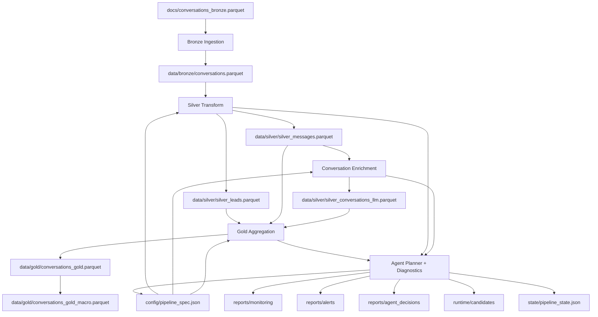

# Pipeline Medalhão com Agente Autônomo Governado por Impacto

Entrega final do teste técnico de Data & AI Engineering descrito em [docs/technical-test-data-ai-engineering.md](/home/lucas/projects/lucas54neves/namastex-test/docs/technical-test-data-ai-engineering.md). O projeto implementa um pipeline em Python para transformar conversas transacionais de WhatsApp em uma arquitetura Bronze -> Silver -> Gold, com atualização automática da camada analítica quando a fonte cresce e um agente governado por impacto para diagnóstico, proposta estruturada, candidate materialization, promoção segura, aprovação explícita e fallback.

## Objetivo da entrega

O enunciado pede mais do que uma análise pontual: pede uma infraestrutura persistente que permaneça "viva", gerencie o pipeline, monitore falhas e mantenha a camada Gold atualizada. A solução entregue atende esse objetivo com os seguintes blocos:

- Pipeline em Python puro, organizado em camadas claras.
- Bronze como réplica controlada da fonte original.
- Silver como camada de limpeza, normalização, deduplicação, mascaramento e organização por lead.
- Gold como camada analítica para segmentação, personas, audiência, sinais comerciais e sentimento.
- Agente governado por impacto para classificar propostas em `low`/`medium`/`high`, materializar candidatos isolados, promover mudanças seguras, solicitar aprovação para mutações estruturais e preservar o último estado íntegro.
- Execução pontual e execução contínua com polling para reprocessar automaticamente quando a Bronze muda.

## Como a solução responde ao enunciado

| Requisito do teste | Como foi atendido |
| --- | --- |
| Python puro | Implementação em `src/pipeline/` e `scripts/` |
| Pipeline em 3 camadas | Publicação em `data/bronze/`, `data/silver/` e `data/gold/` |
| Pipeline vivo | Fingerprint da fonte em `state/pipeline_state.json` e daemon em `scripts/run_pipeline_daemon.py` |
| Agente que gerencia o pipeline | Diagnóstico, planejamento, alerta, fallback e playbooks em `src/pipeline/agent/` |
| Limpeza, transformação e análise | Regras em `src/pipeline/transforms/` e validações em `src/pipeline/quality/` |
| Mascaramento de dados sensíveis | Política de publicação segura e validações anti-vazamento em Silver e Gold |

## Arquitetura do projeto

### Visão em camadas

- `docs/conversations_bronze.parquet` é a fonte transacional de entrada usada como Bronze raw source.
- `Bronze` replica a fonte para uma área controlada de processamento.
- `Silver` gera três artefatos: uma visão principal por lead, uma visão auxiliar por mensagem e uma visão intermediária por conversa para enriquecimento semântico.
- `Gold` consolida métricas e classificações analíticas por lead.
- O agente observa o ciclo, valida contratos, registra relatórios, materializa candidatos em `runtime/candidates/`, aciona alertas e executa fallback quando necessário.

### Diagrama mermaid



### Organização do código

```text
src/pipeline/
  agent/          diagnostico, aprovacao, alertas, playbooks e planejamento
  io/             leitura/escrita parquet e json
  orchestration/  ciclo de execucao, jobs publicos e compilacao da spec
  quality/        validacoes, politica de publicacao e quarentena
  runtime/        ambiente, estado, spec, Langfuse e runtime opcional de LLM
  transforms/     transformacoes Bronze, Silver, Gold e enrichment por conversa

scripts/
  run_pipeline.py
  run_pipeline_daemon.py
  monitor_pipeline.py
  plan_pipeline.py
  bootstrap_langfuse_prompt.py
```

## Fluxo de dados

### Bronze

- Lê `docs/conversations_bronze.parquet`.
- Replica a fonte para `data/bronze/conversations.parquet`.
- Valida colunas obrigatórias, canal suportado e consistência básica.
- Trata `first_message_outbound` como sinal diagnóstico, não como bloqueio hard, para preservar fidelidade da fonte real.

### Silver

Publica três artefatos:

- `data/silver/silver_leads.parquet`: visão principal por `lead_key`.
- `data/silver/silver_messages.parquet`: rastreabilidade por mensagem com deduplicação e campos mascarados.
- `data/silver/silver_conversations_llm.parquet`: enriquecimento semântico por `conversation_id`.

Principais responsabilidades:

- organização por lead
- parsing de `metadata`
- deduplicação por chave semântica estável
- extração de sinais de contato, veículo, concorrente e sinistro
- mascaramento de PII mantendo dimensão do valor original
- publicação apenas de colunas seguras

### Gold

Publica dois artefatos:

- `data/gold/conversations_gold.parquet`: visão analítica por `lead_key`.
- `data/gold/conversations_gold_macro.parquet`: visão agregada de toda a base em distribuições e rankings por dimensão categórica.

Entre os atributos calculados em `conversations_gold.parquet` estão:

- volume e distribuição de mensagens
- bucket de engajamento
- persona e audiência
- lead temperature
- intent stage
- price sensitivity
- contact readiness
- competitor pressure
- commercial urgency
- dominant email provider
- closure outcome group
- conversation sentiment

O artefato `conversations_gold_macro.parquet` agrega toda a base pelas 11 dimensões categóricas (persona, audiência, temperatura, bucket, sentimento, closure, competitor pressure, price objection, urgência, intent stage e email provider) mais um bloco de métricas numéricas (`numeric_snapshot`). Cada linha representa um par `(dimension, dimension_value)` com contagens, proporções e ranking dentro da dimensão.

## Como rodar o projeto

### Pré-requisitos

- Python 3.11
- ambiente virtual local em `venv/`
- dependências instaladas a partir de `requirements.txt`

### Setup local

Crie o ambiente virtual local do repositório e instale todas as dependências Python a partir de `requirements.txt`:

```bash
python3 -m venv venv
venv/bin/pip install -r requirements.txt
venv/bin/python -m pre_commit install
venv/bin/python -m pre_commit install --hook-type pre-push
cp .env.example .env
```

Os hooks de `git` deste repositório dependem do ambiente virtual local em `venv/`. Se esse diretório não existir, crie o ambiente e reinstale os hooks com os comandos acima antes de tentar `commit` ou `push`.

Se quiser validar a instalação antes de executar o pipeline, rode os testes com o ambiente virtual local:

```bash
venv/bin/python -m pytest -q
```

O arquivo `.env.example` ja vem alinhado ao baseline de validacao local: sem provider externo e com `Langfuse` desabilitado por padrao.

### Execução local baseline

O caminho baseline do repositório não depende de rede nem de credenciais externas. Ele usa fallback determinístico para o enrichment semântico e mantém `Langfuse` desligado.

```bash
PIPELINE_ENABLE_LLM_ENRICHMENT=0 venv/bin/python scripts/run_pipeline.py --force
```

Saídas principais após a execução:

- `data/bronze/conversations.parquet`
- `data/silver/silver_leads.parquet`
- `data/silver/silver_messages.parquet`
- `data/silver/silver_conversations_llm.parquet`
- `data/gold/conversations_gold.parquet`
- `data/gold/conversations_gold_macro.parquet`
- `reports/monitoring/latest_run_report.json`
- `reports/monitoring/latest_plan_report.json`
- `reports/monitoring/agent_autonomy_metrics.json`
- `reports/monitoring/latest_agent_report.json`
- `reports/monitoring/latest_alert_report.json`
- `reports/agent_decisions/proposals/`
- `reports/agent_decisions/autonomy/latest_autonomy_decision.json`
- `runtime/candidates/<proposal_id>/`
- `state/pipeline_state.json`

### Runtime com paths configuráveis

O pipeline continua assumindo o layout local do repositório por padrão, mas agora também aceita overrides por ambiente para separar código de storage persistente. Isso permite executar o mesmo `scripts/run_pipeline.py` em Databricks usando Workspace Files para código e Unity Catalog Volumes para entrada e saídas.

Variáveis de path suportadas:

- `PIPELINE_INPUT_FILE`: arquivo parquet bruto de entrada
- `PIPELINE_DATA_DIR`: raiz persistente de `bronze/`, `silver/`, `gold/` e `quarantine/`
- `PIPELINE_REPORTS_DIR`: raiz persistente de relatórios operacionais
- `PIPELINE_STATE_DIR`: raiz persistente de estado do pipeline
- `PIPELINE_RUNTIME_DIR`: raiz persistente de `runtime/candidates/`
- `PIPELINE_CONFIG_DIR`: diretório opcional para `pipeline_spec.json` e `agent_autonomy_policy.json`

Sem essas variáveis, o comportamento local atual permanece o mesmo.

### Execução contínua

Para manter o pipeline vivo com polling periódico:

```bash
PIPELINE_ENABLE_LLM_ENRICHMENT=0 venv/bin/python scripts/run_pipeline_daemon.py --force-first-run --poll-interval-seconds 300
```

Comportamento:

- o runtime calcula fingerprint da fonte a partir de path, tamanho e `mtime`
- se nada mudou, a execução é pulada
- se a fonte cresceu ou mudou, Bronze, Silver e Gold são reprocessadas
- o estado operacional é persistido em `state/pipeline_state.json`

### Monitoramento e planejamento

```bash
venv/bin/python scripts/monitor_pipeline.py
venv/bin/python scripts/plan_pipeline.py
```

- `monitor_pipeline.py` consolida snapshot operacional do pipeline.
- `plan_pipeline.py` roda o planner de autonomia que detecta drift, classifica impacto, materializa candidatos e promove apenas mudanças permitidas por política.

### Autonomia governada por impacto

- A política canônica fica em `config/agent_autonomy_policy.json`.
- Propostas estruturadas são persistidas em `reports/agent_decisions/proposals/`.
- Cada candidato é materializado de forma isolada em `runtime/candidates/<proposal_id>/`.
- A última decisão de promoção ou retenção fica em `reports/agent_decisions/autonomy/latest_autonomy_decision.json`.
- Métricas do ciclo autônomo ficam em `reports/monitoring/agent_autonomy_metrics.json`.
- Mudanças `high impact` nunca são auto-promovidas; ficam em `awaiting_approval` até registro em `state/approval_state.json`.

### Execução com Docker Compose

Há suporte opcional a `docker-compose.yml` para subir o pipeline em modo contínuo junto com uma stack local de Langfuse.

```bash
docker compose up --build
```

Esse modo é útil para observabilidade e integração com providers, mas não é necessário para o baseline de validação local.

## Variáveis de ambiente relevantes

As variáveis estão exemplificadas em [`.env.example`](/home/lucas/projects/lucas54neves/namastex-test/.env.example). As mais importantes para a entrega são:

- `PIPELINE_ENABLE_LLM_ENRICHMENT`: habilita ou desabilita enrichment por provider externo.
- `PIPELINE_POLL_INTERVAL_SECONDS`: intervalo do daemon.
- `PIPELINE_ENABLE_LANGFUSE`: habilita observabilidade do enrichment.
- `PIPELINE_LLM_OPENAI_MODEL`: override opcional do modelo OpenAI.
- `PIPELINE_LLM_ANTHROPIC_MODEL`: override opcional do modelo Anthropic.
- `OPENAI_API_KEY`: credencial opcional para provider OpenAI.
- `ANTHROPIC_API_KEY`: credencial opcional para provider Anthropic.

### Variáveis para execução em Databricks

O deploy automatizado via GitHub Actions usa duas classes de configuração.

GitHub Secrets:

| Nome | Obrigatória | Uso |
| --- | --- | --- |
| `DATABRICKS_HOST` | Sim | Host HTTPS do workspace Databricks |
| `DATABRICKS_TOKEN` | Sim | Token usado pelo CLI/API do Databricks |
| `OPENAI_API_KEY` | Não | Credencial para habilitar enrichment com OpenAI |
| `ANTHROPIC_API_KEY` | Não | Credencial para habilitar enrichment com Anthropic |
| `LANGFUSE_PUBLIC_KEY` | Não | Credencial de observabilidade Langfuse |
| `LANGFUSE_SECRET_KEY` | Não | Credencial de observabilidade Langfuse |

GitHub Variables:

| Nome | Obrigatória | Uso | Default interno |
| --- | --- | --- | --- |
| `DATABRICKS_WORKSPACE_ROOT` | Não | Raiz de deploy em Workspace Files | `/Workspace/Shared/namastex-test` |
| `DATABRICKS_JOB_NAME` | Não | Nome do job gerenciado | `namastex-test-pipeline` |
| `DATABRICKS_JOB_COMPUTE_MODE` | Não | Modo de compute do job Databricks | `serverless` |
| `DATABRICKS_CATALOG` | Não | Catalog Unity Catalog | `main` |
| `DATABRICKS_SCHEMA` | Não | Schema Unity Catalog | `ops` |
| `DATABRICKS_INPUT_VOLUME` | Não | Volume UC para input Bronze | `bronze_input` |
| `DATABRICKS_OUTPUT_VOLUME` | Não | Volume UC para outputs persistidos | `pipeline_output` |
| `DATABRICKS_INPUT_FILENAME` | Não | Nome do arquivo Bronze enviado ao volume | `conversations_bronze.parquet` |
| `DATABRICKS_SERVERLESS_ENVIRONMENT_VERSION` | Não | Environment version usada em compute serverless | `2` |
| `DATABRICKS_SPARK_VERSION` | Não | Runtime Spark do job | `15.4.x-scala2.12` |
| `DATABRICKS_NODE_TYPE_ID` | Não | Tipo de nó do cluster do job | `Standard_DS3_v2` |
| `DATABRICKS_NUM_WORKERS` | Não | Quantidade de workers do job | `1` |
| `DATABRICKS_RUN_POLL_SECONDS` | Não | Intervalo de polling até o término da run | `10` |
| `PIPELINE_ENABLE_LLM_ENRICHMENT` | Não | Liga enrichment com provider externo | nenhum |
| `PIPELINE_LLM_OPENAI_MODEL` | Não | Modelo OpenAI usado no enrichment | nenhum |
| `PIPELINE_LLM_ANTHROPIC_MODEL` | Não | Modelo Anthropic usado no enrichment | nenhum |
| `PIPELINE_LLM_TIMEOUT_SECONDS` | Não | Timeout por chamada do runtime LLM | nenhum |
| `PIPELINE_LLM_MAX_RETRIES` | Não | Máximo de tentativas do runtime LLM | nenhum |
| `PIPELINE_ENABLE_LANGFUSE` | Não | Liga observabilidade Langfuse | nenhum |
| `PIPELINE_LANGFUSE_ALLOW_LOCAL_PROMPT_FALLBACK` | Não | Permite fallback local do prompt | nenhum |
| `PIPELINE_LANGFUSE_PROMPT_NAME` | Não | Nome do prompt no Langfuse | nenhum |
| `PIPELINE_LANGFUSE_PROMPT_LABEL` | Não | Label do prompt no Langfuse | nenhum |
| `PIPELINE_LANGFUSE_TRACE_NAME` | Não | Nome base dos traces | nenhum |
| `LANGFUSE_BASE_URL` | Não | Base URL da instância Langfuse | nenhum |

Defaults internos:

- workspace root: `/Workspace/Shared/namastex-test`
- job compute mode: `serverless`
- catalog/schema: `main.ops`
- input volume: `bronze_input`
- output volume: `pipeline_output`
- job name: `namastex-test-pipeline`

## Deploy e execução no Databricks

O repositório agora inclui o workflow [databricks-deploy-run.yml](/home/lucas/projects/lucas54neves/namastex-test/.github/workflows/databricks-deploy-run.yml), acionado em `push` para `main` e por `workflow_dispatch`.

Para a entrega final, o caminho recomendado é o baseline sem provider externo e sem Langfuse. Nesse modo, basta configurar no GitHub `DATABRICKS_HOST` e `DATABRICKS_TOKEN`; as demais variáveis podem ficar nos defaults internos documentados acima.

### Passo a passo mínimo

1. Configure no repositório GitHub os secrets obrigatórios `DATABRICKS_HOST` e `DATABRICKS_TOKEN`.
2. Se necessário, ajuste GitHub Variables como `DATABRICKS_WORKSPACE_ROOT`, `DATABRICKS_CATALOG`, `DATABRICKS_SCHEMA`, `DATABRICKS_INPUT_VOLUME` e `DATABRICKS_OUTPUT_VOLUME`. Se nada for definido, o workflow usa os defaults internos.
3. Garanta que o principal associado ao token tenha permissão para criar ou atualizar schema, volumes e job no workspace alvo, além de escrever no volume de input.
4. Dispare o workflow `Databricks Deploy And Run` por `workflow_dispatch` ou faça `push` para `main`.
5. Acompanhe a execução no GitHub Actions. O workflow instala dependências, roda os testes `tests/test_jobs.py` e `tests/test_databricks.py`, sincroniza o repositório para `Workspace Files`, reconcilia recursos no Databricks, faz upload do Bronze e executa o job.
6. Considere a entrega validada quando a run do GitHub Actions terminar com sucesso e os artefatos esperados estiverem presentes no volume de output do Databricks.

### O que o workflow faz

- sincroniza o repositório para `Workspace Files`
- reconcilia catalog, schema, input volume, output volume e job
- envia `docs/conversations_bronze.parquet` para o volume de input via Databricks CLI usando `dbfs:/Volumes/...`
- cria o job em `serverless` por padrão e referencia `requirements.txt` do workspace como dependência do ambiente do job
- passa os paths críticos do pipeline por argumentos explícitos (`--input-file`, `--data-dir`, `--reports-dir`, `--state-dir`, `--runtime-dir`, `--config-dir`)
- propaga para o job apenas variáveis explícitas de runtime de LLM e Langfuse quando estiverem definidas
- dispara o job Databricks e falha o workflow se a run falhar

O script operacional chamado pelo workflow é [scripts/databricks_deploy_run.py](/home/lucas/projects/lucas54neves/namastex-test/scripts/databricks_deploy_run.py), com a lógica de provisionamento e payload do job em [src/pipeline/infrastructure/databricks.py](/home/lucas/projects/lucas54neves/namastex-test/src/pipeline/infrastructure/databricks.py).

### Como validar a execução

Mapeamento de runtime no Databricks:

- código: `/Workspace/Shared/namastex-test/...`
- input bruto: `/Volumes/<catalog>/<schema>/<input_volume>/conversations_bronze.parquet`
- outputs persistidos: `/Volumes/<catalog>/<schema>/<output_volume>/{data,reports,state,runtime}`

Ao final da run, os seguintes artefatos devem existir no volume de output:

- `data/bronze/conversations.parquet`
- `data/silver/silver_leads.parquet`
- `data/silver/silver_messages.parquet`
- `data/silver/silver_conversations_llm.parquet`
- `data/gold/conversations_gold.parquet`
- `data/gold/conversations_gold_macro.parquet`
- `reports/monitoring/latest_run_report.json`
- `reports/monitoring/latest_plan_report.json`
- `reports/monitoring/agent_autonomy_metrics.json`
- `reports/monitoring/latest_agent_report.json`
- `reports/monitoring/latest_alert_report.json`
- `reports/agent_decisions/proposals/`
- `reports/agent_decisions/autonomy/latest_autonomy_decision.json`
- `state/pipeline_state.json`

Mapeamento de upload no workflow:

- upload do arquivo Bronze via CLI: `dbfs:/Volumes/<catalog>/<schema>/<input_volume>/conversations_bronze.parquet`
- path consumido pelo job em runtime: `/Volumes/<catalog>/<schema>/<input_volume>/conversations_bronze.parquet`
- dependencies do job serverless: instala o projeto a partir de `/Workspace/Shared/namastex-test` e depois aplica `-r /Workspace/Shared/namastex-test/requirements.txt`
- bootstrap do script principal no Databricks: usa `PIPELINE_CONFIG_DIR` para resolver a raiz do projeto quando `__file__` não estiver disponível no runtime

### Configurações opcionais

Para um cenário com OpenAI habilitada no Databricks, configure no GitHub:

- Secret: `OPENAI_API_KEY`
- Variable: `PIPELINE_ENABLE_LLM_ENRICHMENT=1`
- Variable: `PIPELINE_LLM_OPENAI_MODEL=gpt-5-mini`

Para um cenário com Anthropic habilitada no Databricks, configure no GitHub:

- Secret: `ANTHROPIC_API_KEY`
- Variable: `PIPELINE_ENABLE_LLM_ENRICHMENT=1`
- Variable: `PIPELINE_LLM_ANTHROPIC_MODEL=claude-sonnet`

Se também quiser Langfuse:

- Secrets: `LANGFUSE_PUBLIC_KEY`, `LANGFUSE_SECRET_KEY`
- Variables: `PIPELINE_ENABLE_LANGFUSE=1`, `LANGFUSE_BASE_URL`, `PIPELINE_LANGFUSE_PROMPT_NAME`, `PIPELINE_LANGFUSE_PROMPT_LABEL`

### Pré-requisitos e diagnóstico

Pré-requisitos operacionais no workspace:

- Unity Catalog habilitado
- permissão efetiva do principal usado no GitHub para criar ou atualizar o schema configurado, criar ou atualizar os volumes configurados e criar ou atualizar o job
- permissão efetiva de escrita no volume de input configurado, porque o workflow faz upload via `dbfs:/Volumes/<catalog>/<schema>/<input_volume>/...`
- se o catálogo não puder ser criado pelo principal, ele deve existir previamente e o valor de `DATABRICKS_CATALOG` deve apontar para esse catálogo
- compatibilidade do workspace com o modo de compute configurado; em workspaces `serverless-only`, mantenha `DATABRICKS_JOB_COMPUTE_MODE=serverless`
- compute compatível com os parâmetros do job quando o modo for `classic`

Diagnóstico operacional:

- falhas no upload para o volume preservam `stderr` e `stdout` do Databricks CLI no erro do workflow
- o upload tenta novamente por um curto intervalo antes de falhar definitivamente, reduzindo erro transitório logo após a reconciliação do volume
- falhas da run do job preservam `life_cycle_state`, `result_state`, `state_message` e, quando disponível, a saída de `jobs/runs/get-output` da task para acelerar a análise no GitHub Actions

### Configuração do Langfuse

O projeto continua com suporte a Langfuse self-hosted para prompt management e tracing do enrichment semântico, mas isso depende de uma instância realmente disponível e de credenciais válidas.

Para usar Langfuse de verdade, o ambiente precisa ter:

- `PIPELINE_ENABLE_LANGFUSE=1`
- `LANGFUSE_BASE_URL` apontando para a instância ativa
- `LANGFUSE_PUBLIC_KEY` válida
- `LANGFUSE_SECRET_KEY` válida
- `PIPELINE_LANGFUSE_PROMPT_NAME` e `PIPELINE_LANGFUSE_PROMPT_LABEL` compatíveis com o prompt bootstrapado

No `docker-compose.yml`, a stack local inclui:

- `langfuse-web`
- `langfuse-worker`
- `langfuse-bootstrap`

O bootstrap do prompt é feito por `scripts/bootstrap_langfuse_prompt.py`.

Importante:

- Se `PIPELINE_ENABLE_LANGFUSE=1` estiver ativo com credenciais placeholder como `lf_pk_change_me` e `lf_sk_change_me`, o runtime não usa Langfuse de forma real.
- Nesse caso, o pipeline faz fallback para prompt local e segue executando quando o modo fallback está permitido.
- Para validação local baseline, o caminho mais previsível continua sendo `PIPELINE_ENABLE_LLM_ENRICHMENT=0` com `PIPELINE_ENABLE_LANGFUSE=0`, que ja é o default do `.env.example`.
- Para validar Langfuse end-to-end localmente, suba primeiro a stack com `docker compose up --build` antes de rodar o pipeline com enrichment habilitado.

## Testes

Conforme a regra do repositório, os testes devem ser executados com o ambiente virtual local:

```bash
venv/bin/python -m pytest -q
venv/bin/python -m pytest tests/test_jobs.py -q
venv/bin/python -m pytest tests/test_requirements_adherence.py -q
```

A suíte de aderência cobre explicitamente:

- Silver principal com granularidade por lead
- ausência de PII crua nos artefatos publicados
- persistência do enrichment por conversa
- atualização automática da Gold após crescimento da Bronze
- persistência de estado operacional
- geração de diagnóstico e alerta em falha simulada

## Agente operacional

O agente executa um ciclo explícito de autonomia governada por impacto. O uso de LLM é opcional e nunca substitui os gates determinísticos. Suas responsabilidades incluem compilar e aplicar a `pipeline_spec.json`, detectar drift, gerar e materializar propostas estruturadas, promover apenas mudanças autorizadas por política, reter mudanças `high impact` em aprovação, diagnosticar falhas, executar playbooks seguros, emitir relatórios e alertas, e restaurar o último estado íntegro em falhas inesperadas.

### Módulos da camada agêntica

| Módulo | Caminho | Responsabilidade |
| --- | --- | --- |
| `agent.py` | `src/pipeline/agent/` | Diagnóstico de falhas de validação e remediação reativa |
| `autonomy.py` | `src/pipeline/agent/` | Classificação de impacto, materialização de candidatos e promoção de spec |
| `approval.py` | `src/pipeline/agent/` | Rastreamento do estado de aprovação humana ou de agente |
| `planner.py` | `src/pipeline/agent/` | Detecção proativa de drift e orquestração do ciclo de propostas |
| `execution_planner.py` | `src/pipeline/agent/` | Planejamento adaptativo de ordem de execução dos estágios |
| `llm_advisor.py` | `src/pipeline/agent/` | Auto-revisão por LLM e priorização de propostas |
| `gold_designer.py` | `src/pipeline/agent/` | Design de colunas analíticas da Gold via LLM |
| `playbooks.py` | `src/pipeline/agent/` | Definição das ações de remediação disponíveis |
| `alerts.py` | `src/pipeline/agent/` | Emissão, deduplicação e supressão de alertas de incidente |
| `operator.py` | `src/pipeline/orchestration/` | Loop ReAct principal — orquestra todos os ciclos |

### Ciclos de execução

O agente opera em dois ciclos distintos por execução.

**Ciclo proativo** (`plan_pipeline_spec`): detecta drift antes da execução principal. Cinco detectores varrem observações do runtime para gerar propostas. Para cada proposta, a spec candidata é materializada de forma isolada, submetida a gates e, se aprovada, promovida automaticamente ou retida para aprovação. O output é `reports/monitoring/latest_plan_report.json`.

**Ciclo reativo** (`run_cycle` / loop ReAct): executa até 15 iterações para processar os estágios Bronze → Silver → Gold. Em cada iteração, valida o estágio atual e, em caso de falha, chama `diagnose_validation_failures` seguido de `attempt_auto_remediation`. Se a remediação resolve o problema, o loop continua; caso contrário, o estágio é reexecutado ou o loop é interrompido. Exceptions não tratadas acionam fallback para o último estado íntegro.

### Classificação de impacto

A política canônica fica em `config/agent_autonomy_policy.json` e define o comportamento por família de mutação.

| Família | Impacto padrão | Auto-promovível | Exige aprovação |
| --- | --- | --- | --- |
| `schema_update` | `high` | não | sim |
| `segmentation_adjustment` | `high` | não | sim |
| `transformation_rule_change` | `medium` | não | sim |
| `derived_column_addition` | `medium` | sim | não |
| `validation_enhancement` | `low` | sim | não |

### Ciclo de vida das propostas

```
Detecção (planner.py)
  └─> Fingerprint SHA-1 da proposta → proposal_id único
      └─> apply_proposal_to_spec()
          └─> evaluate_candidate() → gate_results + diff
              ├─ gate: contract_validation
              ├─ gate: backward_compatibility
              ├─ gate: privacy_scan
              └─ gate: targeted_tests
          └─> persist_candidate_artifacts() → runtime/candidates/{proposal_id}/
              ├─> Se requires_approval:
              │     └─> agent_self_review_proposal() (LLM)
              │           ├─ confidence >= threshold → approve_proposal("agent") → PROMOVIDA
              │           └─ confidence < threshold  → AWAITING_APPROVAL (aguarda humano)
              ├─> Se safe_auto_promote:
              │     └─> promote_candidate_spec() → pipeline_spec.json + spec_history.json → PROMOVIDA
              └─> Demais casos → CANDIDATE_MATERIALIZED (retida para revisão)
```

Propostas rejeitadas por gate ou por baixa confiança de LLM ficam com status `validation_failed` ou `awaiting_approval` e nunca alteram a spec de produção.

### Artefatos de um candidato materializado

Cada proposta que passa pelos gates produz um diretório isolado:

```
runtime/candidates/{proposal_id}/
├── candidate_spec.json           # spec após a mutação proposta
├── candidate_run_report.json     # status de validação e resultados dos gates
├── candidate_agent_report.json   # impact_class e necessidade de aprovação
├── candidate_diff.json           # diff de schema, privacidade e qualidade
├── candidate_metrics.json        # contadores de pass/fail de validação
└── candidate_test_report.json    # resultado dos testes direcionados
```

Remediações reativas geram um diretório análogo em `runtime/candidates/reactive_{incident_id}/`.

### Pontos de decisão com LLM

Todos os pontos de LLM têm fallback determinístico e nunca bloqueiam a execução.

| Decisão | Módulo | LLM opcional? | Fallback |
| --- | --- | --- | --- |
| Ordenação de estágios | `execution_planner.py` | sim | ordem baseada em presença de artefatos |
| Design de colunas Gold | `gold_designer.py` | sim | 6 colunas analíticas fixas |
| Priorização de propostas | `planner.py` + `llm_advisor.py` | sim | ordem determinística dos detectores |
| Auto-aprovação de proposta | `llm_advisor.py` | sim | retém proposta em `awaiting_approval` |
| Diagnóstico de falha desconhecida | `agent.py` | sim | mapa estático `VALIDATION_CHECK_MAP` |

### Circuit breakers e limites de segurança

- **Loop ReAct**: máximo de 15 iterações (`_MAX_REACT_ITERATIONS`).
- **Reexecução de estágio**: interrompida após 2 falhas consecutivas do mesmo estágio.
- **Circuit breaker de LLM**: após 3 falhas consecutivas de chamada de LLM para diagnóstico, as chamadas são suspensas e o fallback determinístico é usado para os checks restantes.
- **Gates de promoção**: todas as quatro validações (contrato, compatibilidade retroativa, privacidade, testes) precisam passar para qualquer promoção.
- **Auto-aprovação por LLM**: requer `confidence >= threshold` configurado por família (padrão: 0.90 para `schema_update`, 0.85 para `transformation_rule_change`) e `severity != critical`.

### Playbooks de remediação reativa

| Playbook | Auto-aplicável | Risco |
| --- | --- | --- |
| `rebuild_silver_from_bronze` | sim | médio |
| `rebuild_gold_from_silver` | sim | baixo |
| `quarantine_invalid_records` | sim | baixo |
| `fallback_to_last_successful_artifacts` | sim | médio |
| `update_pipeline_spec` | não | alto |

### Principais artefatos operacionais

- `reports/monitoring/latest_run_report.json`
- `reports/monitoring/latest_agent_report.json`
- `reports/monitoring/latest_plan_report.json`
- `reports/monitoring/agent_autonomy_metrics.json`
- `reports/monitoring/latest_execution_plan.json`
- `reports/monitoring/latest_gold_column_plan.json`
- `reports/alerts/`
- `reports/agent_decisions/latest_agent_decision.json`
- `reports/agent_decisions/proposals/`
- `reports/agent_decisions/autonomy/latest_autonomy_decision.json`
- `runtime/candidates/`
- `state/pipeline_state.json`
- `state/approval_state.json`
- `state/pipeline_spec_history.json`

## Decisões técnicas do projeto

### 1. Agente governado por impacto em vez de autonomia irrestrita

O enunciado exige um agente que crie e mantenha o pipeline. A escolha foi evoluir para autonomia governada por impacto: mudanças aditivas e reversíveis podem ser promovidas automaticamente; mudanças estruturais e semânticas ficam bloqueadas por política e aprovação humana. Isso eleva autonomia sem perder auditabilidade.

### 2. Bronze como réplica fiel e não como camada de correção

A Bronze foi tratada como réplica controlada da fonte original. Isso preserva reprodutibilidade, permite auditoria da entrada e evita esconder problemas reais logo na ingestão.

### 3. Silver principal por lead e Silver auxiliar por mensagem

O enunciado pede Silver organizada por usuário/lead, mas a rastreabilidade por mensagem continua importante para auditoria e agregações. Por isso a solução separa:

- um artefato principal por `lead_key`
- um artefato auxiliar por mensagem
- um artefato intermediário por conversa para semântica

Essa escolha equilibra requisito de negócio, rastreabilidade e clareza do contrato.

### 4. Mascaramento com preservação de dimensão

Dados sensíveis são mascarados mantendo a forma geral do valor, atendendo ao enunciado e preservando utilidade operacional. Além do mascaramento, a publicação remove colunas proibidas e as validações procuram vazamento real em campos textuais.

### 5. Gold atualizada por fingerprint da fonte

Para manter o pipeline "vivo" sem reprocessar inutilmente, o runtime compara fingerprint da Bronze raw source usando caminho, tamanho e tempo de modificação. Essa estratégia é simples, reprodutível e suficiente para o escopo do teste.

### 6. Enrichment semântico opcional com fallback determinístico

O enrichment por conversa suporta providers externos e observabilidade com Langfuse, mas o baseline do projeto não depende disso. Quando o provider está desabilitado, indisponível ou retorna saída inválida, o sistema faz fallback determinístico e mantém o contrato publicado.

### 7. Contrato declarativo central em `config/pipeline_spec.json`

A spec centraliza colunas obrigatórias, buckets válidos, domínios semânticos e regras estruturais do pipeline. Isso facilita validação, planejamento de drift e evolução controlada.

### 8. Fallback para último estado íntegro

Em falhas inesperadas, o operador preserva o último conjunto válido de artefatos. Isso foi escolhido para privilegiar continuidade operacional e evitar publicar saídas parcialmente corrompidas.

### 9. Separação entre qualidade, transformação e orquestração

O código foi organizado para deixar explícita a diferença entre:

- regras de transformação
- política de publicação
- validação de contrato
- orquestração do ciclo
- comportamento do agente

Essa divisão melhora manutenção, testes e legibilidade da entrega.

## Limitações conhecidas

- O fingerprint observa mudança do arquivo de entrada, não CDC linha a linha.
- O modo com provider externo depende de credenciais, rede e disponibilidade do serviço.
- O planner autônomo ainda restringe a promoção ao conjunto inicial de famílias suportadas e validadas deterministicamente.
- O projeto foi otimizado para o dataset e o escopo do teste, não como plataforma multi-tenant completa.
- A camada Gold produz visão por lead (`conversations_gold.parquet`) e visão macro agregada (`conversations_gold_macro.parquet`).
- Alertas do agente são relatórios JSON locais; canal externo via webhook está especificado mas não implementado (`spec-architecture-agent-webhook-alert-channel.md`).
- Módulos `silver.py` e `operator.py` possuem alta complexidade ciclomática; decomposição está especificada mas não implementada (`spec-architecture-module-cyclomatic-decomposition.md`).


## Referências

- [Enunciado técnico](/home/lucas/projects/lucas54neves/namastex-test/docs/technical-test-data-ai-engineering.md)
- [Data dictionary](/home/lucas/projects/lucas54neves/namastex-test/docs/data-dictionary-data-ai-engineering.md)
